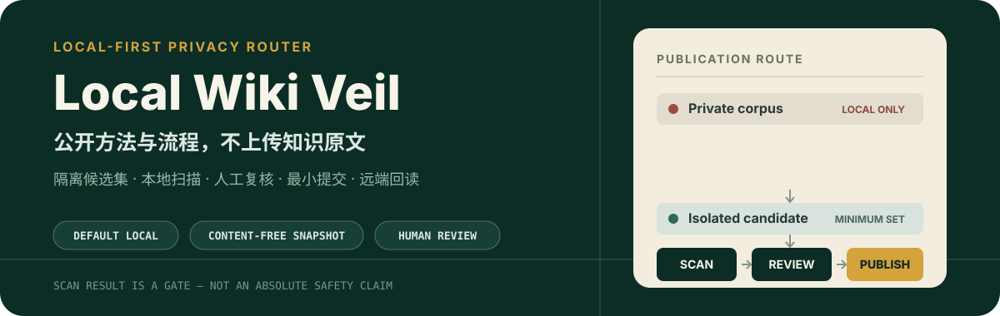
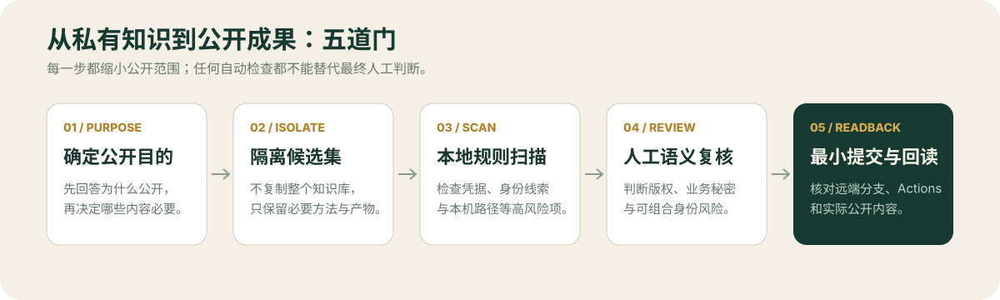

<p align="center">
  
</p>

<p align="center">
  <a href="https://github.com/LUCIENIN/workspace-redaction-app/actions/workflows/privacy-gate.yml"></a>
  <a href="./LICENSE"></a>
  <a href="./SECURITY.md"></a>
</p>

Local Wiki Veil 是面向本地 **LLM Wiki** 与普通工作区的公开前脱敏工具。它不接管私有知识库，也不把源文件上传到第三方服务；它帮助你先建立一个隔离候选集，在本地扫描高风险线索，人工复核后再发布最小必要内容。

> 扫描结果是一道门，不是“绝对安全”证明。二进制文件、Office 元数据、版权、语义型商业秘密和 Git 历史仍需人工检查。

## 先跑通一次

```bash
git clone https://github.com/LUCIENIN/workspace-redaction-app.git
cd workspace-redaction-app
npm run check
```

扫描一个已经隔离的公开候选目录：

```bash
python3 scripts/sanitize_workspace.py scan /path/to/public-candidate \
  --fail-on high
```

导出普通文本工作区的脱敏副本：

```bash
python3 scripts/sanitize_workspace.py export /path/to/public-candidate \
  --output /path/to/new-sanitized-copy
```

导出目标必须位于源目录之外且保持为空；二进制文件与符号链接默认跳过。

## 它保留什么，阻止什么

| 默认保留在本地 | 可进入公开候选集 |
| --- | --- |
| `raw/sources/` 原始资料与附件 | 去身份后的方法、流程和工具 |
| 私密档案、对话与业务判断 | 可复现但不暴露私有内容的示例 |
| 向量索引、队列、缓存与运行状态 | 无标题、无路径、无知识原文的状态快照 |
| 客户、财务、合同、健康与身份材料 | 经人工复核且许可明确的公开素材 |

“由 LLM 生成”不等于“可以公开”。Wiki 页面仍可能携带原始事实、原话、关系和可组合身份线索。

## 公开流程

<p align="center">
  
</p>

1. **确定公开目的**：先写清公开对象与必要范围。
2. **隔离候选集**：不在整个私有知识库上直接发布或覆盖处理。
3. **本地扫描**：检查常见凭据、邮箱、手机号和本机用户路径。
4. **人工复核**：判断自动规则看不懂的语义、版权和组合风险。
5. **最小提交并回读**：核对远端分支、Actions 与实际公开内容。

## 内容零知识快照

`scripts/audit_local_kb.py` 只读取目录计数和白名单状态字段：

```bash
python3 scripts/audit_local_kb.py "$LOCAL_KB" \
  --output ./local-kb-snapshot.json
```

仓库中的 [`data/local-kb-snapshot.json`](./data/local-kb-snapshot.json) 是一次真实但去内容的状态快照。它不包含知识原文、标题、文件名、源文件路径或本机绝对路径，也不证明任何具体 Wiki 页面适合公开。

## 可视化演示

```bash
npm start
```

打开 `http://127.0.0.1:4173/`。演示 App 无第三方运行依赖，只展示隐私分区、工作原理和已生成的无内容快照；也可以查看[在线演示](https://lucienin.github.io/workspace-redaction-app/)。

## 仓库结构

```text
.
├── scripts/
│   ├── sanitize_workspace.py   # 扫描与隔离导出
│   └── audit_local_kb.py       # 生成无内容状态快照
├── tests/                      # 隐私边界与行为测试
├── data/                       # 可公开的无内容快照
├── docs/execution-basis.md     # 设计依据与验证口径
└── .github/workflows/          # push / PR 隐私门禁
```

## 已验证与未覆盖

当前门禁会运行单元测试，并对仓库可读文本执行高风险规则扫描。扫描报告只记录文件、规则、严重性、数量和位置，不回显命中的敏感片段。

它不会替你判断：

- PDF、Office、图片、音视频与压缩包中的隐藏内容或元数据；
- 语义型隐私、业务秘密和多条信息组合后的身份暴露；
- 第三方素材的版权、许可证和再分发条件；
- 已进入 Git 历史的真实凭据——此时应先撤销或轮换凭据。

完整口径见[执行依据](./docs/execution-basis.md)与[安全说明](./SECURITY.md)。

## License

[MIT](./LICENSE)
